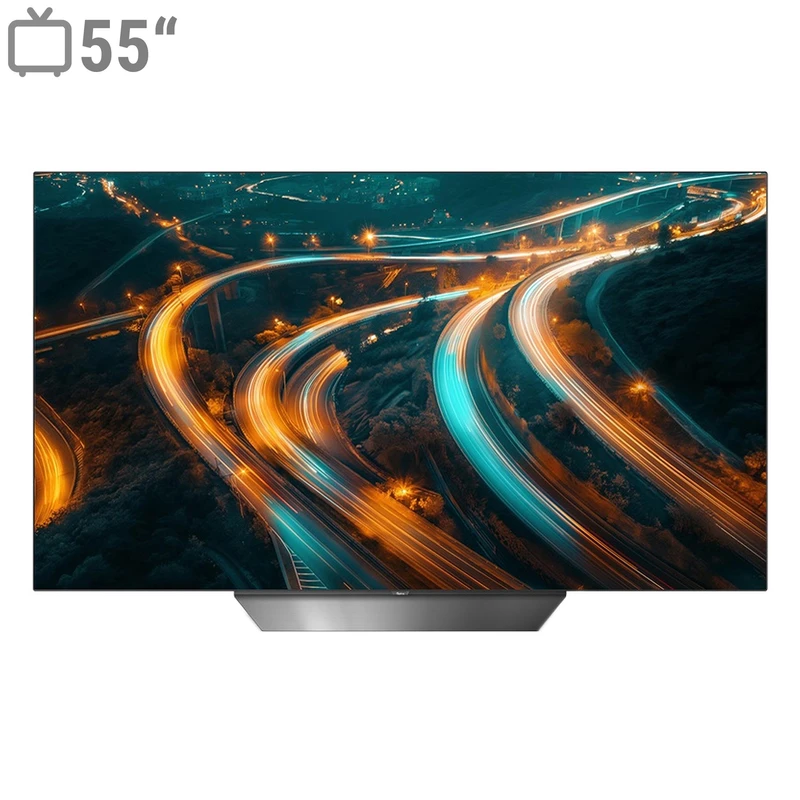

<!DOCTYPE html>
<html lang="en">
<head>
  <meta charset="UTF-8">
  <meta name="viewport" content="width=device-width, initial-scale=1.0">
  <title>8Rivers</title>
  
</head>
<body>
  <!-- Header -->
  <header id="main-header">
    <nav class="navbar">
      <a href="#hero" class="logo">8Rivers</a>
      <ul class="nav-links">
        <li><a href="#about">About</a></li>
        <li><a href="#works">Works</a></li>
        <li><a href="#contact">Contact</a></li>
      </ul>
    </nav>
  </header>

  <!-- Hero -->
  <section id="hero">
    

    

      <h1>Welcome to 8Rivers</h1>
      
Exploring works and ideas

    

  </section>

  <!-- About -->
  <section id="about">
    <h2>About</h2>
    
8Rivers notes and works collection.

  </section>

  <!-- Works -->
  <section id="works">
    <h2>Works</h2>
    

      <!-- Repeat 15 items -->
      

        
        <h3>Work 1</h3>
      

      

        
        <h3>Work 2</h3>
      

      

        
        <h3>Work 3</h3>
      

      

        
        <h3>Work 4</h3>
      

      

        
        <h3>Work 5</h3>
      

      

        
        <h3>Work 6</h3>
      

      

        
        <h3>Work 7</h3>
      

      

        
        <h3>Work 8</h3>
      

      

        
        <h3>Work 9</h3>
      

      

        
        <h3>Work 10</h3>
      

      

        
        <h3>Work 11</h3>
      

      

        
        <h3>Work 12</h3>
      

      

        
        <h3>Work 13</h3>
      

      

        
        <h3>Work 14</h3>
      

      

        
        <h3>Work 15</h3>
      

    

  </section>

  <!-- Contact -->
  <section id="contact">
    <h2>Contact</h2>
    <form>
      <input type="text" placeholder="Your name">
      <input type="email" placeholder="Your email">
      <textarea rows="5" placeholder="Your message"></textarea>
      <button type="submit">Send</button>
    </form>
  </section>

  <footer>
    
&copy; 2025 8Rivers. All rights reserved.

  </footer>

  <!-- Modal -->
  

    

      <button class="close-btn" id="closeModal">&times;</button>
      

        <iframe id="modalVideo" src="" allowfullscreen></iframe>
      

      

    

  

  
</body>
</html>
